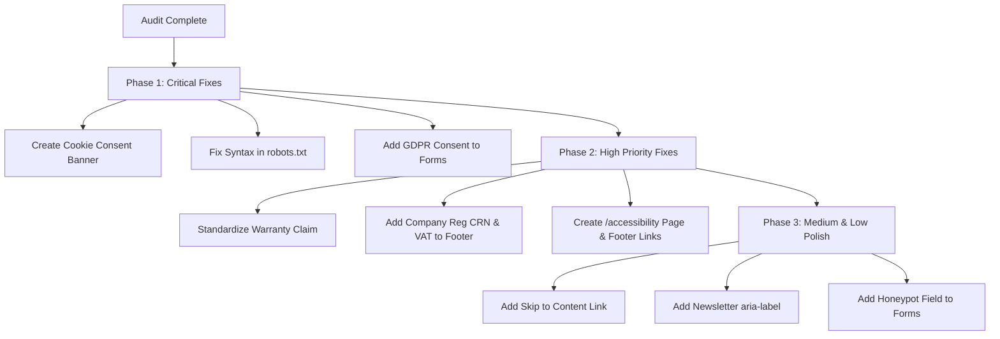

# Codebase & Website Audit Report: MR. KHAN Mobile Repair

**Target Domain:** mrkhanmobiles.co.uk  
**Business Name:** MR. KHAN Repair Experts (Khan Mobile and Accessories Liverpool Ltd)  
**Location:** Co-located inside Liverpool Post Office, 83-85 London Rd, Liverpool L3 8JA, UK  
**Phone:** 07707 733038 / +44 7707 733038  
**Audit Date:** July 30, 2026

---

## Executive Summary

A comprehensive code, legal compliance, GDPR, SEO, accessibility, and security audit was conducted across all files in the `mrkhanmobiles.co.uk` repository.

While the application features a modern UI built with React 18, Vite, TanStack Router, Tailwind CSS, and Supabase, **critical legal compliance gaps, major content warranty contradictions, GDPR non-compliance risks, and technical SEO defects** were identified.

### Key Findings Snapshot:

1. **CRITICAL Legal & GDPR Non-Compliance:** Complete absence of a Cookie Consent Banner, missing `/accessibility` page, missing cookie settings control, lack of GDPR consent checkboxes on all forms (`/book`, `/contact`, quote form, newsletter), and missing UK Companies House registration number (CRN) & VAT details required by UK Companies Act 2006.
2. **HIGH Warranty Contradiction (6-Month vs 12-Month):** Severe content mismatch across the site — Homepage Hero, Footer, About page, and Warranty page state a **6-Month Warranty**, whereas Root Metadata, Terms of Service, Booking Form, Service Pages, City SEO pages, and Homepage Process section claim a **12-Month Warranty**.
3. **HIGH Technical SEO Defect in `robots.txt`:** `public/robots.txt` contains corrupted syntax (`= \n |,Litemap:...`), rendering the XML Sitemap undetectable by search engines.
4. **CRITICAL Tracker Loading Without Consent:** Meta Pixel (`fbq`) and Google Analytics (`gtag`/`dataLayer`) are triggered on events via `src/lib/funnel-analytics.ts` without user consent, creating UK PECR and ICO enforcement risk.
5. **MEDIUM Accessibility & UX Deficiencies:** Missing "Skip to content" link, unlabeled newsletter form input, opening hours discrepancy between footer (`9:00 - 18:00` Sat-Sun) and business config (`10:00 - 18:00` Sat, `11:00 - 16:00` Sun), and missing standard alias route redirects (`/privacy-policy`, `/terms-and-conditions`, `/cookie-policy`).

---

## Prioritized Audit Findings Matrix

---

### A. LEGAL & COMPLIANCE GAPS

#### 🔴 CRITICAL: Missing Cookie Consent Banner & Unconsented Tracking

- **File:** [src/routes/__root.tsx](file:///e:/mr.-khan-s-digital-hub/mr.-khan-s-digital-hub-main/src/routes/__root.tsx#L1-L279), [src/lib/funnel-analytics.ts](file:///e:/mr.-khan-s-digital-hub/mr.-khan-s-digital-hub-main/src/lib/funnel-analytics.ts#L1-L36)
- **Issue:** No cookie consent banner or modal component exists. Analytics scripts (`gtag`, `fbq`) fire tracking events automatically without user consent.
- **Evidence:** `src/lib/funnel-analytics.ts` invokes `window.gtag` and `window.fbq` directly without checking cookie consent preferences.
- **Risk:** **Legal / ICO Enforcement Risk**. Violates UK Privacy and Electronic Communications Regulations (PECR) and UK GDPR, exposing the business to potential fines from the Information Commissioner's Office (ICO).
- **Fix:** Implement a banner component that blocks non-essential cookies/scripts until explicit user consent is given, and store preference in localStorage/cookies.

#### 🔴 CRITICAL: Missing Privacy Consent Checkboxes & Data Usage Notices on Forms

- **File:** [src/routes/book.tsx](file:///e:/mr.-khan-s-digital-hub/mr.-khan-s-digital-hub-main/src/routes/book.tsx#L550-L635), [src/components/quote-form.tsx](file:///e:/mr.-khan-s-digital-hub/mr.-khan-s-digital-hub-main/src/components/quote-form.tsx#L94-L96), [src/components/newsletter.tsx](file:///e:/mr.-khan-s-digital-hub/mr.-khan-s-digital-hub-main/src/components/newsletter.tsx#L13-L40)
- **Issue:** Booking form (`/book`) collects full PII (Name, Email, Phone, Address, Postcode) with **zero** privacy notice or consent checkbox. Quote form contains plain text without a link to Privacy Policy. Newsletter form collects email with no privacy notice.
- **Evidence:**
  ```tsx
  // src/components/quote-form.tsx (L94-L96)
  <p className="text-xs text-muted-foreground text-center">
    By submitting, you agree to be contacted about your repair.
  </p> // No link to /privacy, no explicit opt-in checkbox
  ```
- **Risk:** **Legal / GDPR Non-Compliance**. Collecting personal data without clear privacy disclosures and explicit opt-in violates UK GDPR Article 6 & Article 13.
- **Fix:** Add a mandatory checkbox on booking and contact forms: `"I agree to the [Privacy Policy](/privacy) and [Terms](/terms)"`, and add privacy disclosure text under newsletter input.

#### 🔴 CRITICAL: Unlinked "Data Privacy Guaranteed" Text

- **File:** [src/routes/index.tsx](file:///e:/mr.-khan-s-digital-hub/mr.-khan-s-digital-hub-main/src/routes/index.tsx#L411)
- **Issue:** Homepage lists `"Data privacy guaranteed — your personal data is safe"` in a feature list without providing a hyperlink to the Privacy Policy (`/privacy`).
- **Evidence:**
  ```tsx
  // src/routes/index.tsx (L411)
  "Data privacy guaranteed — your personal data is safe", // Plain string in array, unlinked
  ```
- **Risk:** **Trust & Compliance**. Assuring users of data privacy without linking to the official privacy policy reduces trust and fails legal disclosure requirements.
- **Fix:** Hyperlink "Data privacy guaranteed" directly to `/privacy` or add an adjacent Privacy Policy link.

#### 🟠 HIGH: Missing Mandatory UK Company Disclosures (CRN & VAT Number)

- **File:** [src/config/business.ts](file:///e:/mr.-khan-s-digital-hub/mr.-khan-s-digital-hub-main/src/config/business.ts#L6), [src/components/site-footer.tsx](file:///e:/mr.-khan-s-digital-hub/mr.-khan-s-digital-hub-main/src/components/site-footer.tsx#L125-L128)
- **Issue:** Footer displays `Khan Mobile and Accessories Liverpool Ltd`, but omits the mandatory Companies House Registration Number (CRN) and VAT Registration Number.
- **Evidence:**
  ```tsx
  // src/components/site-footer.tsx (L126-L127)
  © {new Date().getFullYear()} {business.legalName}. Registered in England & Wales. All rights reserved.
  ```
- **Risk:** **Legal Risk**. Under the UK Companies Act 2006 (s.82) and E-Commerce Regulations 2002, limited companies must state their registered number, place of registration, and VAT number (if registered) on all business websites.
- **Fix:** Update `business.ts` with `companyNumber` (CRN) and `vatNumber`, and render them in `site-footer.tsx`.

#### 🟠 HIGH: Missing `/accessibility` Page & Footer Links for Cookie Settings & Accessibility

- **File:** [src/components/site-footer.tsx](file:///e:/mr.-khan-s-digital-hub/mr.-khan-s-digital-hub-main/src/components/site-footer.tsx#L129-L136)
- **Issue:** No `/accessibility` route exists. Footer only links to `/privacy` and `/terms`. Missing links to `/cookies`, Cookie Settings, and Accessibility.
- **Evidence:**
  ```tsx
  // src/components/site-footer.tsx (L129-L136)
  <div className="flex gap-4 font-medium">
    <Link to="/privacy" ...>Privacy Policy</Link>
    <Link to="/terms" ...>Terms of Service</Link>
  </div> // Missing Cookie Policy, Cookie Settings button, Accessibility statement
  ```
- **Risk:** **Legal & Accessibility Compliance**. Fails UK Public Sector Bodies & Business Accessibility Standards guidelines (WCAG 2.1 AA / Public Policy).
- **Fix:** Create `src/routes/accessibility.tsx`, add `/cookies`, Cookie Settings trigger, and `/accessibility` links to `site-footer.tsx`.

#### 🟡 MEDIUM: Missing Standard Alias Route Redirects (`/privacy-policy`, `/terms-and-conditions`, `/cookie-policy`)

- **File:** [src/routes/privacy.tsx](file:///e:/mr.-khan-s-digital-hub/mr.-khan-s-digital-hub-main/src/routes/privacy.tsx), [src/routes/terms.tsx](file:///e:/mr.-khan-s-digital-hub/mr.-khan-s-digital-hub-main/src/routes/terms.tsx), [src/routes/cookies.tsx](file:///e:/mr.-khan-s-digital-hub/mr.-khan-s-digital-hub-main/src/routes/cookies.tsx)
- **Issue:** Core legal routes are defined at `/privacy`, `/terms`, `/cookies`. standard web paths like `/privacy-policy`, `/terms-and-conditions`, `/cookie-policy` return 404.
- **Risk:** **UX / Broken External Links**. External directory links or user typing common URL paths will land on a 404 page.
- **Fix:** Add route aliases or redirect definitions in TanStack Router.

---

### B. CONTENT ACCURACY & CONSISTENCY

#### 🟠 HIGH: Severe Warranty Duration Contradiction (6-Month vs 12-Month)

- **File:** Multiple files across the codebase
- **Issue:** The site presents conflicting warranty periods to customers depending on which page or component they view.
- **Evidence & Breakdown:**
  - **Claims "6-Month Warranty" (40% of codebase):**
    - [src/routes/index.tsx](file:///e:/mr.-khan-s-digital-hub/mr.-khan-s-digital-hub-main/src/routes/index.tsx#L55): Hero title & meta (`6-Month Warranty`)
    - [src/routes/index.tsx](file:///e:/mr.-khan-s-digital-hub/mr.-khan-s-digital-hub-main/src/routes/index.tsx#L182): Hero badge (`6-Month Warranty`)
    - [src/routes/index.tsx](file:///e:/mr.-khan-s-digital-hub/mr.-khan-s-digital-hub-main/src/routes/index.tsx#L228): Features grid (`Covered by our 6-month warranty`)
    - [src/routes/index.tsx](file:///e:/mr.-khan-s-digital-hub/mr.-khan-s-digital-hub-main/src/routes/index.tsx#L410): Guarantee list (`6-Month Warranty covering parts and labour`)
    - [src/routes/index.tsx](file:///e:/mr.-khan-s-digital-hub/mr.-khan-s-digital-hub-main/src/routes/index.tsx#L432): Trust card (`6-Month Warranty`)
    - [src/routes/index.tsx](file:///e:/mr.-khan-s-digital-hub/mr.-khan-s-digital-hub-main/src/routes/index.tsx#L488): Banner (`Same-day repairs covered by our 6-month warranty`)
    - [src/routes/warranty.tsx](file:///e:/mr.-khan-s-digital-hub/mr.-khan-s-digital-hub-main/src/routes/warranty.tsx#L8-L24): Entire warranty page (`6-month warranty`)
    - [src/components/site-header.tsx](file:///e:/mr.-khan-s-digital-hub/mr.-khan-s-digital-hub-main/src/components/site-header.tsx#L64): Top bar (`6-Month Warranty`)
    - [src/components/site-footer.tsx](file:///e:/mr.-khan-s-digital-hub/mr.-khan-s-digital-hub-main/src/components/site-footer.tsx#L35): Footer about (`6-month warranty`)
    - [src/components/site-footer.tsx](file:///e:/mr.-khan-s-digital-hub/mr.-khan-s-digital-hub-main/src/components/site-footer.tsx#L120): Footer bottom (`6-Month Warranty Included`)
    - [src/routes/about.tsx](file:///e:/mr.-khan-s-digital-hub/mr.-khan-s-digital-hub-main/src/routes/about.tsx#L27-L36): About page (`6-month warranty on parts and labour`)
  - **Claims "12-Month Warranty" (60% of codebase):**
    - [src/routes/__root.tsx](file:///e:/mr.-khan-s-digital-hub/mr.-khan-s-digital-hub-main/src/routes/__root.tsx#L89-L108): Global Root SEO Meta (`12-month warranty`)
    - [src/routes/index.tsx](file:///e:/mr.-khan-s-digital-hub/mr.-khan-s-digital-hub-main/src/routes/index.tsx#L359): Process Step 4 (`Every repair is covered by our 12-month warranty`)
    - [src/routes/terms.tsx](file:///e:/mr.-khan-s-digital-hub/mr.-khan-s-digital-hub-main/src/routes/terms.tsx#L20): Terms of Service (`12-month warranty`)
    - [src/routes/book.tsx](file:///e:/mr.-khan-s-digital-hub/mr.-khan-s-digital-hub-main/src/routes/book.tsx#L35-L159): Booking Page & Price Estimator (`12 Months` / `12-month warranty`)
    - [src/routes/services.tsx](file:///e:/mr.-khan-s-digital-hub/mr.-khan-s-digital-hub-main/src/routes/services.tsx#L27-L33): Services overview (`12-month warranty`)
    - [src/routes/services.$slug.tsx](file:///e:/mr.-khan-s-digital-hub/mr.-khan-s-digital-hub-main/src/routes/services.$slug.tsx#L59-L144): Service detail page (`12-month warranty` & `12 months`)
    - [src/config/services.ts](file:///e:/mr.-khan-s-digital-hub/mr.-khan-s-digital-hub-main/src/config/services.ts#L54-L118): Service definitions (`12-month warranty`)
    - [src/routes/home-repair.tsx](file:///e:/mr.-khan-s-digital-hub/mr.-khan-s-digital-hub-main/src/routes/home-repair.tsx#L16-L58): Home repair page (`12-month warranty`)
    - [src/routes/mail-in.tsx](file:///e:/mr.-khan-s-digital-hub/mr.-khan-s-digital-hub-main/src/routes/mail-in.tsx#L15-L21): Mail-in repair page (`12-month warranty`)
    - [src/routes/locations.tsx](file:///e:/mr.-khan-s-digital-hub/mr.-khan-s-digital-hub-main/src/routes/locations.tsx#L30): Locations page (`12-month warranty`)
    - [src/routes/repairs.$city.tsx](file:///e:/mr.-khan-s-digital-hub/mr.-khan-s-digital-hub-main/src/routes/repairs.$city.tsx#L36-L158): City landing pages (`12-month warranty`)
    - [src/routes/_authenticated/admin.services.tsx](file:///e:/mr.-khan-s-digital-hub/mr.-khan-s-digital-hub-main/src/routes/_authenticated/admin.services.tsx#L40-L286): Admin service defaults (`12-month warranty`)
- **Risk:** **Legal & Consumer Rights Risk**. Violates UK Consumer Rights Act 2015 and Trading Standards / ASA regulations regarding misleading advertising.
- **Fix:** Standardize warranty duration across all components, configuration files, and legal documents (confirm single business standard: 6 Months or 12 Months).

#### 🟡 MEDIUM: Operating Hours Contradiction Between Footer and Config

- **File:** [src/config/business.ts](file:///e:/mr.-khan-s-digital-hub/mr.-khan-s-digital-hub-main/src/config/business.ts#L19-L27), [src/components/site-footer.tsx](file:///e:/mr.-khan-s-digital-hub/mr.-khan-s-digital-hub-main/src/components/site-footer.tsx#L68-L72)
- **Issue:** Weekend opening hours differ between the site footer and central config/JSON-LD schema.
- **Evidence:**
  - `src/components/site-footer.tsx` (L69, L71): `Mon–Fri: 9:00 – 19:00`, `Sat–Sun: 9:00 – 18:00`
  - `src/config/business.ts` & `__root.tsx` JSON-LD: `Saturday: 10:00 – 18:00`, `Sunday: 11:00 – 16:00`
- **Risk:** **UX / Customer Disappointment**. Customers visiting on Sunday between 16:00 and 18:00 based on the footer text will find the shop closed.
- **Fix:** Reference `business.hours` directly in `site-footer.tsx` instead of hardcoding text string.

#### 🟡 MEDIUM: Minor Address Formatting Inconsistency

- **File:** [src/config/business.ts](file:///e:/mr.-khan-s-digital-hub/mr.-khan-s-digital-hub-main/src/config/business.ts#L13), [src/components/site-header.tsx](file:///e:/mr.-khan-s-digital-hub/mr.-khan-s-digital-hub-main/src/components/site-header.tsx#L66)
- **Issue:** Street address is written as `83, 85 London Rd` in `business.ts` and header, whereas marketing copy uses `83-85 London Road`.
- **Risk:** **Local SEO Consistency**. Google Maps prefers consistent street address formatting across NAP (Name, Address, Phone) citations.
- **Fix:** Standardize `line1: "83-85 London Road"` across `business.ts` and all template strings.

---

### C. DATA COLLECTION & GDPR

#### 🔴 CRITICAL: Absence of User Consent Management for Tracking Scripts

- **File:** [src/lib/funnel-analytics.ts](file:///e:/mr.-khan-s-digital-hub/mr.-khan-s-digital-hub-main/src/lib/funnel-analytics.ts#L1-L36)
- **Issue:** Analytics events for Google Analytics and Meta Pixel trigger unconditionally whenever `trackFunnelEvent` is called (e.g. quote start, booking click).
- **Evidence:** `trackFunnelEvent` executes `window.gtag` and `window.fbq` without verifying if consent was granted via a consent manager.
- **Risk:** **GDPR / PECR Non-Compliance**. Fines under UK Data Protection Act 2018.
- **Fix:** Wrap `trackFunnelEvent` execution in a check for `localStorage.getItem("cookie_consent") === "granted"`.

#### 🟠 HIGH: Inadequate Data Protection Disclosures for Stored PII

- **File:** [src/lib/booking.functions.ts](file:///e:/mr.-khan-s-digital-hub/mr.-khan-s-digital-hub-main/src/lib/booking.functions.ts#L6-L82)
- **Issue:** System collects sensitive customer data (Full Name, Email, Phone, Home Address, Postcode, Fault Details) and inserts directly into Supabase tables `bookings`, `leads`, `newsletter_subscribers`.
- **Evidence:** Functions `createBooking`, `createLead`, `subscribeNewsletter` write to database without automated retention limits, data encryption beyond standard TLS, or user-configurable privacy preferences.
- **Risk:** **GDPR Compliance**. Lack of clear data retention workflows and user erasure mechanism.
- **Fix:** Implement database cron or edge function to auto-anonymize or purge customer PII after 6 years (retention policy limit stated in `/privacy`).

---

### D. SEO & TECHNICAL AUDIT

#### 🟠 HIGH: Corrupted Syntax in `robots.txt` Blocking Sitemap Discovery

- **File:** [public/robots.txt](file:///e:/mr.-khan-s-digital-hub/mr.-khan-s-digital-hub-main/public/robots.txt#L7-L8)
- **Issue:** `public/robots.txt` contains corrupted characters and invalid directives.
- **Evidence:**
  ```txt
  User-agent: *
  Allow: /

  Disallow: /admin/
  Disallow: /auth/

  =
  |,Litemap: https://www.mrkhanmobiles.co.uk/sitemap.xml
  ```
- **Risk:** **SEO Indexation Defect**. Search engine bots cannot parse the sitemap location directive due to invalid character syntax.
- **Fix:** Fix `public/robots.txt` line 7-8 to read: `Sitemap: https://www.mrkhanmobiles.co.uk/sitemap.xml`.

#### 🟢 LOW: LocalBusiness Schema Opening Hours Mismatch

- **File:** [src/routes/__root.tsx](file:///e:/mr.-khan-s-digital-hub/mr.-khan-s-digital-hub-main/src/routes/__root.tsx#L163-L174)
- **Issue:** Schema.org `OpeningHoursSpecification` in `__root.tsx` uses hardcoded hours that differ from the footer text.
- **Fix:** Dynamically generate JSON-LD `openingHoursSpecification` from `business.hours` object in `business.ts`.

---

### E. ACCESSIBILITY AUDIT

#### 🟠 HIGH: Missing "Skip to Content" Keyboard Navigation Link

- **File:** [src/routes/__root.tsx](file:///e:/mr.-khan-s-digital-hub/mr.-khan-s-digital-hub-main/src/routes/__root.tsx#L202-L214)
- **Issue:** There is no `<a href="#main-content" className="sr-only focus:not-sr-only">Skip to content</a>` link at the top of the body for keyboard users.
- **Risk:** **WCAG 2.1 AA Non-Compliance** (Success Criterion 2.4.1 Bypass Blocks). Keyboard users must tab through all header links on every page navigation.
- **Fix:** Add a skip link at the top of `RootShell` in `__root.tsx` and target `<main id="main-content">`.

#### 🟡 MEDIUM: Unlabeled Form Input in Newsletter Component

- **File:** [src/components/newsletter.tsx](file:///e:/mr.-khan-s-digital-hub/mr.-khan-s-digital-hub-main/src/components/newsletter.tsx#L29-L36)
- **Issue:** Email input in the footer newsletter subscription form lacks an associated `<label>` or `aria-label` attribute.
- **Evidence:**
  ```tsx
  // src/components/newsletter.tsx (L29-L36)
  <Input
    type="email"
    required
    placeholder="Your email"
    value={email}
    onChange={(e) => setEmail(e.target.value)}
    className="..."
  /> // Missing aria-label="Your email address"
  ```
- **Risk:** **WCAG 2.1 AA Non-Compliance** (Success Criterion 4.1.2 Name, Role, Value). Screen readers announce "edit text" without contextual context.
- **Fix:** Add `aria-label="Email address for newsletter"` to the input element.

---

### F. PERFORMANCE & SECURITY AUDIT

#### 🟡 MEDIUM: Unformatted Phone Numbers in `tel:` Links in Admin

- **File:** [src/routes/_authenticated/admin.tsx](file:///e:/mr.-khan-s-digital-hub/mr.-khan-s-digital-hub-main/src/routes/_authenticated/admin.tsx#L1136)
- **Issue:** Tel link uses unformatted phone string with spaces e.g. `href={"tel:07707 733038"}` instead of clean digits `tel:+447707733038`.
- **Evidence:**
  ```tsx
  href={`tel:${b.phone}`} // May contain spaces, breaking dialer on mobile devices
  ```
- **Risk:** **Mobile UX**. Spaces in `tel:` links fail to initiate phone call on certain Android/iOS browsers.
- **Fix:** Format phone number string: `href={`tel:${b.phone.replace(/\s+/g, '')}`}`.

#### 🟡 MEDIUM: In-Memory Rate Limiter Resetting in Serverless Environments & Lack of Honeypot / CAPTCHA

- **File:** [src/lib/rate-limit.ts](file:///e:/mr.-khan-s-digital-hub/mr.-khan-s-digital-hub-main/src/lib/rate-limit.ts#L4-L28), [src/routes/book.tsx](file:///e:/mr.-khan-s-digital-hub/mr.-khan-s-digital-hub-main/src/routes/book.tsx)
- **Issue:** Server functions use an in-memory `Map` (`ipCache`) for rate limiting. In serverless edge runtime, in-memory state is transient. Furthermore, public forms lack honeypot inputs or Cloudflare Turnstile CAPTCHA.
- **Risk:** **Security / Spam Vulnerability**. Spambots can bypass client JS and flood Supabase database tables with fake leads/bookings.
- **Fix:** Add a hidden honeypot form field (`website_hp`) to forms and reject submissions if filled.

---

## Action Plan & Remediation Roadmap



### Action Items Summary Table

| ID         | Category      | Item Description                                           | Priority    | Target File(s)                                                                             |
| :--------- | :------------ | :--------------------------------------------------------- | :---------- | :----------------------------------------------------------------------------------------- |
| **L-01**   | Legal & GDPR  | Build Cookie Consent Banner & gate analytics scripts       | 🔴 CRITICAL | `src/components/cookie-banner.tsx`, `src/routes/__root.tsx`, `src/lib/funnel-analytics.ts` |
| **L-02**   | Legal & GDPR  | Add GDPR consent checkboxes to booking & quote forms       | 🔴 CRITICAL | `src/routes/book.tsx`, `src/components/quote-form.tsx`                                     |
| **L-03**   | Legal & GDPR  | Hyperlink "Data privacy guaranteed" to Privacy Policy      | 🔴 CRITICAL | `src/routes/index.tsx`                                                                     |
| **SEO-01** | SEO           | Repair corrupted syntax in `robots.txt`                    | 🟠 HIGH     | `public/robots.txt`                                                                        |
| **C-01**   | Content       | Resolve 6-Month vs 12-Month warranty discrepancy           | 🟠 HIGH     | All route files & `src/config/services.ts`                                                 |
| **L-04**   | Legal         | Add UK Company Reg Number (CRN) & VAT to footer            | 🟠 HIGH     | `src/config/business.ts`, `src/components/site-footer.tsx`                                 |
| **L-05**   | Legal & A11y  | Add `/accessibility` route, Cookie Settings & footer links | 🟠 HIGH     | `src/routes/accessibility.tsx`, `src/components/site-footer.tsx`                           |
| **A-01**   | Accessibility | Add "Skip to Content" keyboard shortcut link               | 🟠 HIGH     | `src/routes/__root.tsx`                                                                    |
| **C-02**   | Content       | Sync footer weekend opening hours with business config     | 🟡 MEDIUM   | `src/components/site-footer.tsx`                                                           |
| **A-02**   | Accessibility | Add `aria-label` to Newsletter email input                 | 🟡 MEDIUM   | `src/components/newsletter.tsx`                                                            |
| **SEC-01** | Security      | Add bot honeypot field to booking & quote forms            | 🟡 MEDIUM   | `src/routes/book.tsx`, `src/components/quote-form.tsx`                                     |
| **SEO-02** | SEO           | Add route alias redirects for `/privacy-policy` etc.       | 🟡 MEDIUM   | `src/router.tsx`                                                                           |

---

_Report generated by Antigravity AI Assistant for MR. KHAN Mobile Repair._
